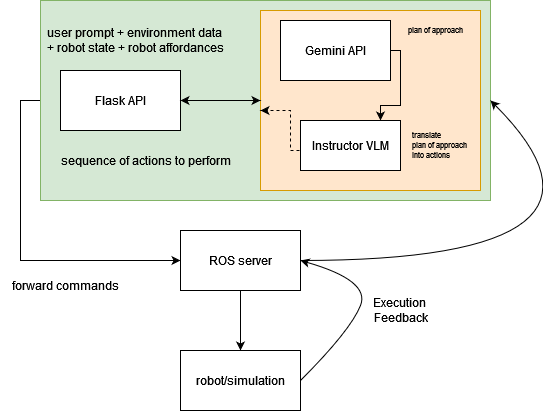

# Gemini + LLMs for Robots *(Tiago Pal)*

[](https://www.youtube.com/watch?v=oC8lpK0tnGA "Gemini, LLMs for Robots")

## Table of Contents

- [Gemini + LLMs for Robots *(Tiago Pal)*](#gemini--llms-for-robots-tiago-pal)
  - [Table of Contents](#table-of-contents)
  - [Problem Statement](#problem-statement)
  - [Requirements](#requirements)
  - [Architecture](#architecture)
  - [Installation](#installation)
    - [ROS](#ros)
    - [Tiago and Simulation](#tiago-and-simulation)
    - [Gemini](#gemini)
    - [Ollama and LLaVA](#ollama-and-llava)
  - [Usage](#usage)
    - [Interacting with the Robot](#interacting-with-the-robot)
      - [Example Commands](#example-commands)

## Problem Statement

Controlling robots through natural language instructions is a complex task that requires integrating advanced AI models with robotic systems. This project aims to simplify robot control by leveraging Gemini AI, and LLaVA models to interpret and execute natural language commands, making robotic interactions more intuitive and accessible.

## Requirements

1. Python 3.8
2. ROS Noetic
3. Tiago Pal robot
4. Simulation environment (gazebo)
5. Flask
6. Google Cloud credentials for Vertex AI
7. Ollama and LLaVA model

## Architecture



- User Interface: A web-based interface built with Flask to input commands.

- LLM Models: Integration of Gemini, Ollama, and LLaVA for generating and interpreting commands.

- Robot Control: ROS-based control of the Tiago Pal robot, including movement, arm manipulation, and sensory feedback.

## Installation

### ROS

Install ROS Noetic on your system following the instructions from the official ROS website.

<https://wiki.ros.org/Robots/TIAGo/Tutorials/Installation/InstallUbuntuAndROS>

### Tiago and Simulation

Install the Tiago Pal robot simulation packages by following the instructions from the official ROS website:

<https://wiki.ros.org/Robots/TIAGo/Tutorials/Installation/Testing_simulation>

Launch the Tiago Pal simulation:

```sh
    roslaunch tiago_gazebo tiago_gazebo.launch public_sim:=true
```

### Gemini

Install the Vertex AI Python SDK:

```sh
pip install google-cloud-aiplatform
```

Set up your Google Cloud credentials:

```sh
export GOOGLE_APPLICATION_CREDENTIALS=<path_to_your_credentials_file.json>
```

Initialize Vertex AI:

```python
import vertexai
vertexai.init(project="YOUR_PROJECT_ID", location="YOUR_REGION")
```

### Ollama and LLaVA

To install ollama

```sh
curl -fsSL https://ollama.com/install.sh | sh
```

Install the necessary Python packages:

```sh

pip install ollama
```

This project uses only llava-llama3 *(but in theory you can swap in another capable VLM)* to install that version ~code for using gemini 1.5 as a vlm has been removed temporarily~:

```sh
ollama run llava-llama3
```

## Usage

Running the Simulation and Flask App
    Launch the ROS simulation:

```sh
roslaunch tiago_gazebo tiago_gazebo.launch public_sim:=true
```

Start the Flask app:

```sh
export FLASK_APP=app.py
flask run
```

Open your web browser and navigate to <http://127.0.0.1:5000> to access the control interface.

### Interacting with the Robot

Use the web interface to input commands.
The Flask app will process these commands using Gemini, Ollama, and LLaVA.

The robot will execute the commands, providing feedback on each action.

#### Example Commands

- "Move forward"

- "Pick up the object"
- "Extend arm"
- "Rotate head left"

Monitoring and Feedback system

The app provides real-time feedback on the robot's actions, ensuring each step is completed before proceeding to the next.
Check the console output for detailed logs and any error messages.
